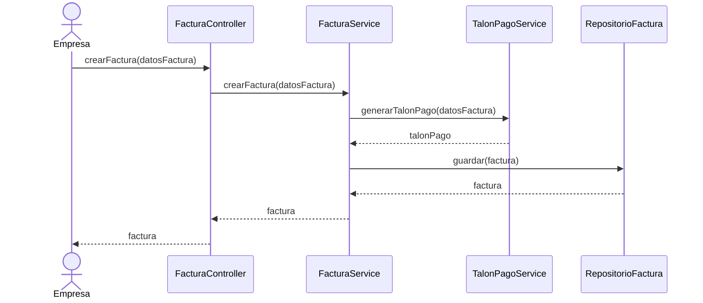
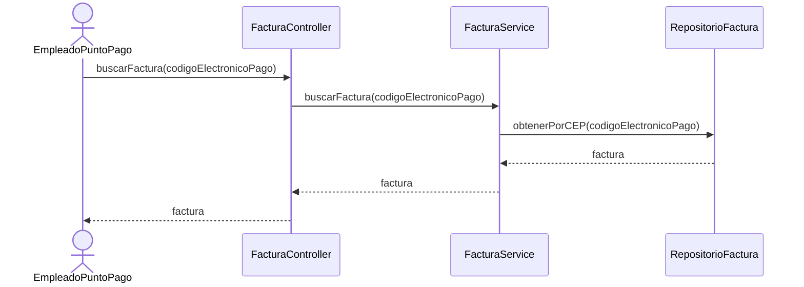
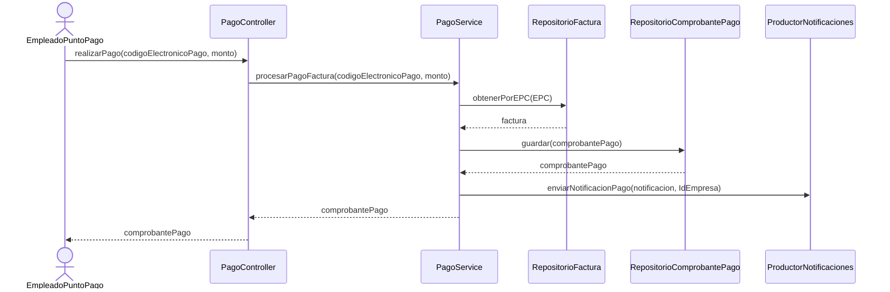

# EZ-PAY - Backend

Ez-Pay es una aplicación que simula el funcionamiento esencial de **Pago Fácil**, permitiendo a empresas emitir facturas con su correspondiente *talón de pago* y a clientes abonar dichas facturas en un punto de pago físico.  
El backend está desarrollado con **Spring Boot**, **Java 21**, **PostgreSQL** y **RabbitMQ** para el envío de notificaciones de facturas pagadas.

Los dos casos de uso principales que aborda el sistema son:

- **Generación del talón de pago**.
- **Pago de la factura en un punto de pago**.

---

## Acerca del proyecto

**Integrantes:**  
- Montilla, Tomas - 53.331  
- Sachetti, Milagros - 53.867 

**Materia:** Programación de Aplicaciones Distribuidas

**Universidad:** Universidad Tecnológica Nacional - Facultad Regional Tucumán

**Año:** 2025

## Diagramas de Secuencia

### 🔹 Caso de uso: Generar talón de pago

Una empresa desea emitir una factura. Para que esta pueda ser pagada en un punto físico, para ello necesita generar un **talón de pago**.


### 🔹 Caso de uso: Cliente paga factura

Un cliente se dirige a un punto de pago físico. El empleado busca la factura mediante el código electrónico de pago, valida el monto abonado, registra el pago y el sistema actualiza el estado a Pagada. Luego se envía una notificación a la empresa.





## Endpoints

Para más detalles visitar los [docs](https://ez-pay-prod.onrender.com/swagger-ui/index.html)

### 🔐 Autenticación

#### Registrar Usuario
```
POST /api/auth/register
```
Crea una nueva cuenta de usuario (EMPLEADO o EMPRESA).

**Payload:**
```json
{
  "firstname": "Juan",
  "lastName": "Pérez",
  "birth": "1995-05-20",
  "username": "jperez95",
  "password": "unaClaveMuySegura123",
  "email": "juan.perez@dominio.com",
  "phone": "1122334455",
  "rol": "EMPLEADO"
}
```

#### Iniciar Sesión
```
POST /api/auth/login
```
Autentica un usuario y devuelve un JWT.

**Payload:**
```json
{
  "username": "jperez95",
  "password": "unaClaveMuySegura123"
}
```

---

### 🏢 Empresa

#### Registrar Empresa
```
POST /api/company/registerCompany
```
🔒 Requiere autenticación (ROL='EMPRESA')

Registra una nueva empresa en el sistema.

**Payload:**
```json
{
  "category": "ELECTRICIDAD",
  "address": "Av. Corrientes 1234",
  "province": "Buenos Aires",
  "city": "CABA",
  "monthlyInvoices": 1000,
  "cuit": "20333444555",
  "legalName": "Empresa SA",
  "numberOfPayments": 500,
  "averageInvoice": 1500.50
}
```

---

### 📄 Facturas

#### Crear Factura
```
POST /api/v1/invoices
```
🔒 Requiere autenticación (ROL='EMPRESA')

Crea una nueva factura con su talón de pago asociado.

* En caso de no proveer ambas fechas de vencimiento, la factura siempre podrá ser pagada.
* Si solo se provee `dueDate`, la factura podrá ser pagada hasta esa fecha.
* Si se proveen ambas fechas, la factura podrá ser pagada hasta `secondDueDate`.

**Payload:**
```json
{
  "receiverName": "Empresa SA",
  "receiverCUIL": "20333444555",
  "clientIdentifier": "12345678901234",
  "amount": 1500.50,
  "secondAmount": 500.00,
  "dueDate": "2025-12-31",
  "secondDueDate": "2026-01-31",
  "issueDate": "2025-11-19"
}
```

#### Obtener Facturas
```
GET /api/v1/invoices?page=0&size=10
```
🔒 Requiere autenticación

Devuelve las facturas de la empresa autenticada de forma paginada.

#### Obtener Factura por ID
```
GET /api/v1/invoices/{id}
```
🔒 Requiere autenticación

Recupera una factura específica por su UUID.

#### Obtener Factura por Código Electrónico
```
GET /api/v1/invoices/epc/{epc}
```
🔒 Requiere autenticación

Recupera una factura mediante su Código Electrónico de Pago (EPC).

---

### 💳 Pagos

#### Realizar Pago
```
POST /api/v1/payments
```
🔒 Requiere autenticación (ROL='EMPLEADO')

Registra el pago de una factura y envía notificación a la empresa.

**Payload:**
```json
{
  "epc": "000101520075253342033344455612300000000016",
  "amountReceived": 1000.00
}
```

---

## Estructura de Responses

### AuthResponseDTO
```json
{
  "token": "eyJhbGciOiJIUzI1NiIsInR5cCI6IkpXVCJ9..."
}
```

### InvoiceResponse
```json
{
  "id": "550e8400-e29b-41d4-a716-446655440000",
  "companyId": 1,
  "receiverName": "Empresa SA",
  "receiverCUIL": "20333444555",
  "clientIdentifier": "12345678901234",
  "amount": 1500.50,
  "secondAmount": 500.00,
  "dueDate": "2025-12-31",
  "secondDueDate": "2026-01-31",
  "issueDate": "2025-11-19",
  "status": "PENDING",
  "paymentStub": {
    "id": "650e8400-e29b-41d4-a716-446655440000",
    "electronicPaymentCode": "000101520075253342033344455612300000000016",
    "barcodeType": "CODE_128A",
    "currentAmount": 1500.50,
    "appliedDueDate": "2025-12-31",
    "canBePaid": true
  }
}
```

### InvoicePaymentResponse
```json
{
  "paymentReceiptId": "750e8400-e29b-41d4-a716-446655440000",
  "epc": "000101520075253342033344455612300000000016",
  "amountPaid": 1000.00,
  "paymentDateTime": "2025-12-06T14:30:00Z",
  "receiverName": "Empresa SA",
  "receiverCUIL": "20333444555",
  "employeeId": 123,
  "paymentPointId": 456
}
```

### PageInvoiceResponse
```json
{
  "content": [
    {
      "id": "550e8400-e29b-41d4-a716-446655440000",
      "companyId": 1,
      "receiverName": "Empresa SA",
      "status": "PENDING",
      ...
    }
  ],
  "totalElements": 50,
  "totalPages": 5,
  "size": 10,
  "number": 0,
  "first": true,
  "last": false,
  "empty": false
}
```

## Cómo ejecutarlo 

Para ejecutar el proyecto EZ-PAY de forma local, sigue los siguientes pasos.

1. Levantar la infraestructura

```bash
docker-compose up -d
```

2. Agregar un empleado a la DB

Una vez que el contenedor de PostgreSQL esté activo, debes insertar datos iniciales, incluyendo un punto de pago y un usuario `EMPLEADO` (con la contraseña `unaClaveMuySegura123` hasheada) para poder registrar el pago de una factura.

```bash
docker exec -it ez-pay-postgres-1 psql -U myuser -d mydatabase
```

Una vez dentro de la consola de `psql` ejecutar:

```sql
INSERT INTO payment_point
(id, address, "name")
VALUES(1, 'Av. Principal 123', 'Sucursal Centro');

INSERT INTO user_entity
(id, birth, email, firstname, last_name, "password", phone, rol, username)
VALUES(1, '1995-05-20', 'juan.perez@dominio.com', 'Juan', 'Pérez', '$2a$10$9AJHogeADbE6t.C8WN1yZOfIDos2h/ntJvJBWKlAOaPQqXY3C.Q2e', '1122334455', 'EMPLEADO', 'jperez95');

INSERT INTO employee
(id, payment_point_id, user_id)
VALUES(1, 1, 1);
```

3. Construir y ejecutar el contenedor del backend

```bash
docker build -t ez-pay .
```

```bash
docker run --network=ez-pay_default \
  -p 8080:8080 \
  -e DB_URL="jdbc:postgresql://postgres:5432/mydatabase" \
  -e DB_USERNAME="myuser" \
  -e DB_PASSWORD="secret" \
  -e RABBIT_HOST="rabbitmq" \
  -e RABBIT_PORT="5672" \
  -e RABBIT_VHOST="/" \
  -e RABBIT_USERNAME="admin" \
  -e RABBIT_PASSWORD="admin" \
  -e JWT_SECRET="0d181cdce2e15205aba691bf8c16b68f0a6f99ea0ea8df45cbf7a7afdd48c17d" \
  ez-pay
```
